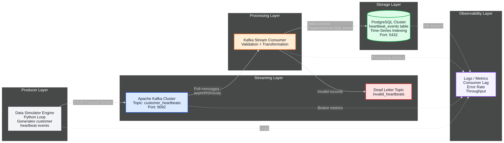
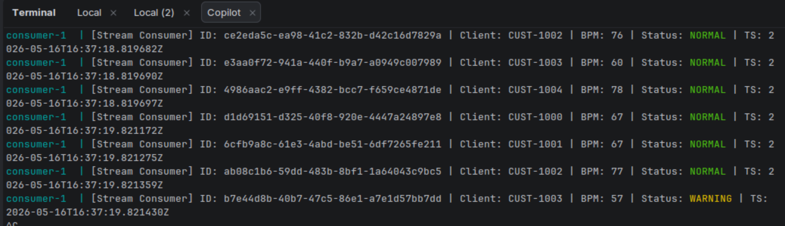
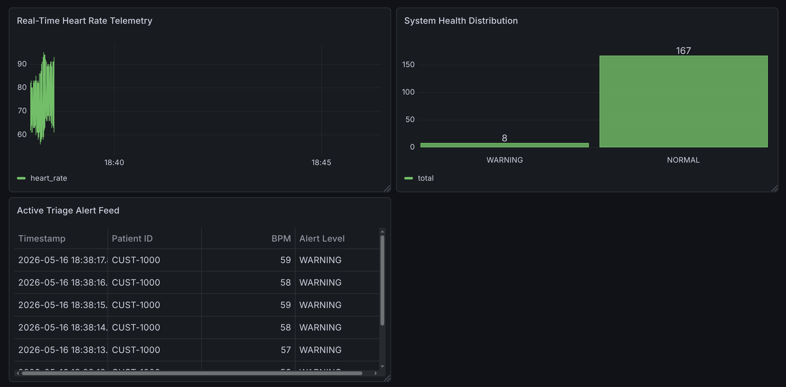
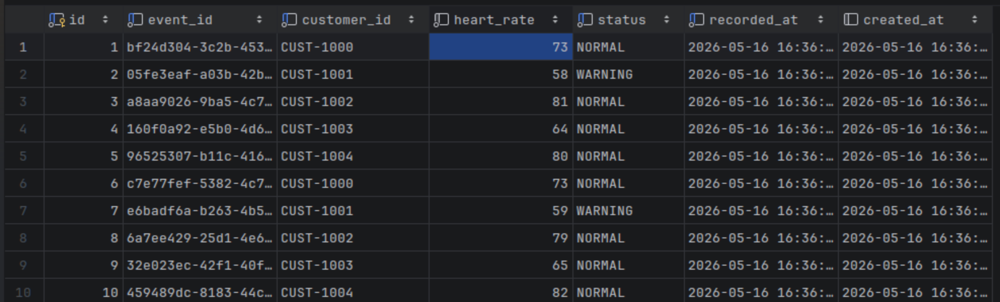

# Heartbeat Monitoring System

A real-time, event-driven consumer heartbeat data pipeline using Kafka, PostgreSQL, and pure functional Python. This system simulates continuous biometric telemetry, processes streams through immutable transformations, and persists enriched records to a time-series database.

---

## High-Level Architectural Flow



### Data Flow Characteristics
- **Producer**: Generates 5 concurrent customer streams; each customer has a baseline BPM with Gaussian drift
- **Kafka Transport**: Events serialized to JSON, keyed by `customer_id` for partitioning
- **Consumer**: Subscribes at earliest offset; processes each event through a status classifier (NORMAL/WARNING/CRITICAL)
- **Persistence**: Writes enriched records to `heart_rate_logs` table with conflict detection (duplicate event_id = no-op)

---

## Quick Start

### Prerequisites
- Docker & Docker Compose v2
- Optional: `psql` client to query the database directly from host

### Start All Services

```zsh
cd /home/mbarndouka/Documents/amalitechkafkalab

# Create local runtime config and replace placeholder passwords before production use
cp .env.example .env

# Build container images
docker compose build

# Start infrastructure (Zookeeper, Kafka, Postgres, Consumer, Producer, Kafka UI, Grafana)
docker compose up -d

# Verify services are running
docker compose ps

# Watch live logs
docker compose logs -f consumer producer
```



### Access Points

| Service | URL / Connection | Credentials |
|---------|------------------|-------------|
| **Grafana** | http://localhost:3000 | Uses `GRAFANA_ADMIN_USER` / `GRAFANA_ADMIN_PASSWORD` from `.env` |
| **Kafka UI** | http://localhost:8080 | No auth required |
| **PostgreSQL** (from host) | `psql -h localhost -p 5432` | Uses `DB_USER`, `DB_PASSWORD`, and `DB_NAME` from `.env` |
| **PostgreSQL** (from container) | `docker compose exec -T postgres sh -c 'psql -U "$POSTGRES_USER" -d "$POSTGRES_DB"'` | — |
| **Kafka Bootstrap** (host) | `localhost:9092` | For external clients |
| **Kafka Bootstrap** (container) | `kafka:29092` | For services inside Docker network |

By default, exposed service ports bind to `127.0.0.1` through `HOST_BIND_ADDRESS`.
This keeps Postgres, Kafka, Kafka UI, and Grafana reachable from your machine without exposing them on every network interface.

Kafka auto-topic creation is disabled. The `kafka-init` service creates
`KAFKA_TOPIC_NAME` explicitly using `KAFKA_TOPIC_PARTITIONS` and
`KAFKA_TOPIC_REPLICATION_FACTOR` from `.env`.

The consumer uses manual Kafka offset commits. A heartbeat message is committed
only after it has been written to PostgreSQL; if the database write fails, the
consumer seeks back to the failed message and retries instead of marking it done.

Producer, consumer, and healthcheck logs are emitted as single-line JSON. Use
`LOG_LEVEL`, `CONSUMER_RETRY_BACKOFF_SECONDS`, `DB_CONNECT_RETRIES`,
`DB_CONNECT_BACKOFF_SECONDS`, and `PRODUCER_BUFFER_RETRY_BACKOFF_SECONDS` in
`.env` to tune runtime diagnostics and transient-failure retry behavior.

### Grafana Monitoring Dashboard



---

## Database Queries

Connect to PostgreSQL and run these checks:

```sql
-- List all tables
SELECT * FROM information_schema.tables WHERE table_schema='public';

-- Count persisted heartbeat records
SELECT COUNT(*) FROM heart_rate_logs;

-- View latest records
SELECT event_id, customer_id, heart_rate, status, recorded_at 
FROM heart_rate_logs 
ORDER BY recorded_at DESC 
LIMIT 10;

-- Aggregation by customer and status
SELECT customer_id, status, COUNT(*), AVG(heart_rate)::INT as avg_bpm
FROM heart_rate_logs
GROUP BY customer_id, status
ORDER BY customer_id;

-- Health check: records written in last minute
SELECT COUNT(*) FROM heart_rate_logs 
WHERE recorded_at > NOW() - INTERVAL '60 seconds';
```



---

## Project Structure

```
└── amalitechkafkalab/
    ├── docker-compose.yml          # Orchestrates all services
    ├── Dockerfile                  # Python app image (consumer + producer)
    ├── pyproject.toml              # Dependencies & package config
    ├── .env.example                # Safe template for local environment overrides
    ├── README.md                   # This file
    │
    ├── database/
    │   └── schema.sql              # PostgreSQL DDL (auto-loaded at startup)
    │
    ├── core/
    │   ├── config.py               # Config loader (env vars → DSN & bootstrap servers)
    │   └── models.py               # Immutable data contracts (HeartbeatEvent, ProcessedHeartbeat)
    │
    ├── producers/
    │   ├── generator.py            # Gaussian random walk BPM simulator
    │   └── app.py                  # Producer main loop
    │
    └── consumers/
        ├── validator.py            # Heart rate classifier (status rules)
        ├── db_client.py            # Thread-pool manager + INSERT executor
        └── app.py                  # Consumer main loop (poll → process → persist)
```

---

## Troubleshooting

**Messages are being produced but not in the database:**
- Ensure the consumer container is running: `docker compose ps | grep consumer`
- Check consumer logs: `docker compose logs consumer | tail -100`
- Verify Postgres is reachable from consumer: `docker compose exec consumer ping postgres`
- Confirm `heart_rate_logs` table exists in `heartbeat_db`: run the SQL queries above

**Kafka connection refused:**
- Services inside Docker must use `kafka:29092` (not `localhost:9092`)
- Host clients use `localhost:9092`
- Check Kafka logs: `docker compose logs kafka | grep -i error`

**Kafka topic not auto-created:**
- Topic auto-creation is intentionally disabled.
- Check the one-shot topic initializer: `docker compose logs kafka-init`
- Confirm the configured topic exists in Kafka UI or with `kafka-topics --list`

**Database connection errors:**
- Postgres container might still be initializing; wait ~5 seconds after `docker compose up -d`
- Check Postgres logs: `docker compose logs postgres`
- Ensure `database/schema.sql` exists and is readable

---

## Common Operations

### Rebuild and restart a single service
```zsh
# After editing consumer code, rebuild the consumer image
docker compose build consumer
docker compose up -d consumer
```

### View detailed logs
```zsh
docker compose logs -f --tail=50 consumer   # Last 50 lines from consumer
docker compose logs -f --tail=50 producer   # Last 50 lines from producer
docker compose logs -f --tail=50 kafka      # Kafka broker logs
```

### Stop and clean up everything
```zsh
docker compose down          # Stop containers
docker compose down -v       # Stop containers and remove volumes (deletes Postgres data!)
```

PostgreSQL data is stored in the named Docker volume `postgres_data`, so normal
container restarts and `docker compose down` preserve records.

### Connect directly to Kafka (exec into producer/consumer container)
```zsh
docker compose exec producer /bin/bash
